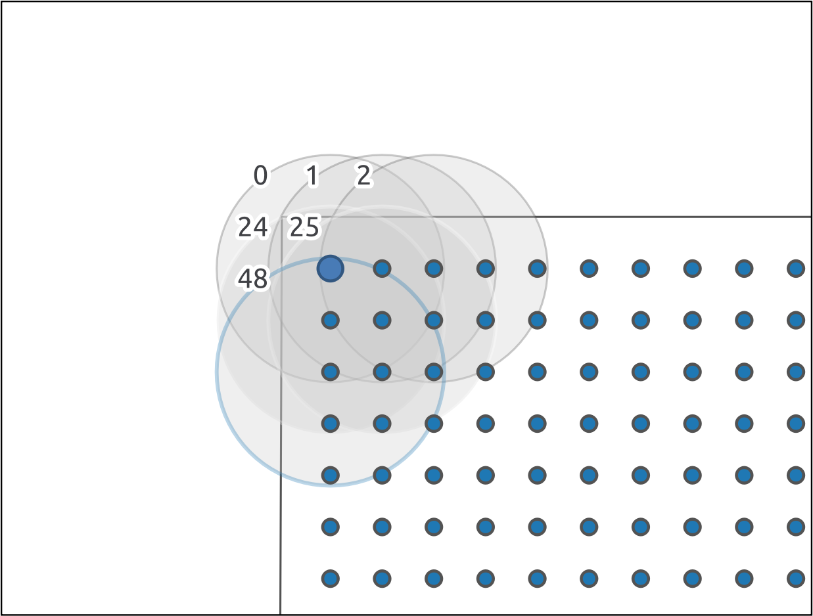
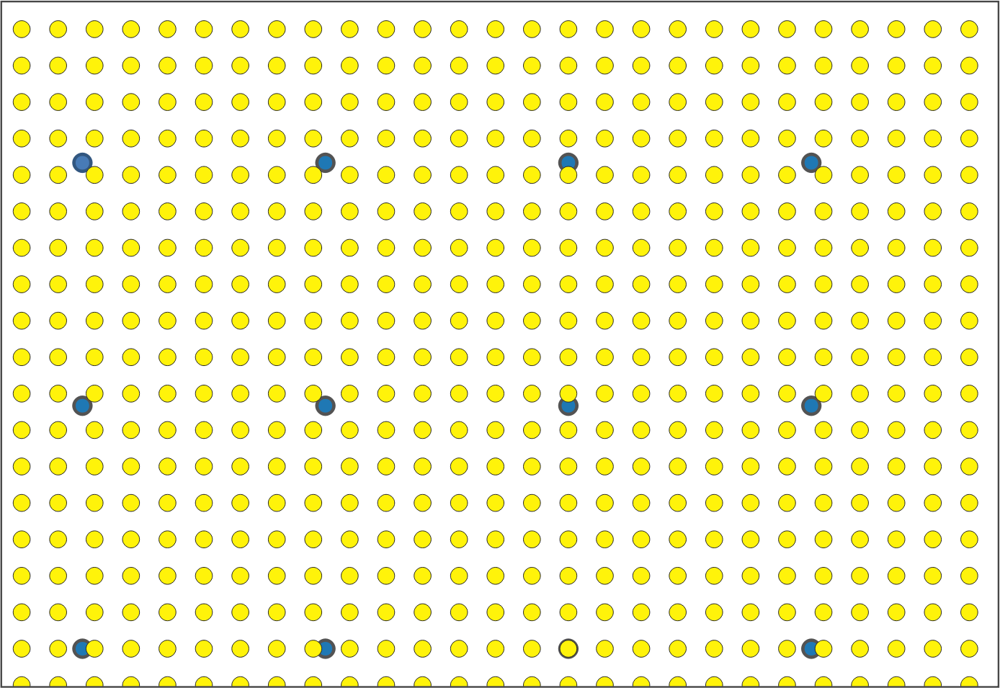
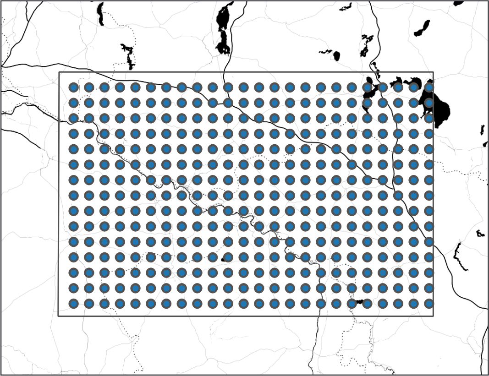

# Software Review for the Software PointSamplingTool

The QGIS Point sampling tool by Borys Jurgiel is a QGIS plugin, which samples polygon attributes and raster values from multiple layers at specified sampling points: <https://plugins.qgis.org/plugins/pointsamplingtool/> .

The latest stable version is 0.5.3.

## Software Metadata:

-   Name: *PointSamplingTool*.
-   Short description: *QGIS plugin for sampling polygon attributes and raster values from multiple layers at specified sampling points*.
-   Reviewed version: *0.5.3*.
-   Reviewed software fork repo: <https://github.com/Research-Squirrel-Engineers/pointsamplingtool>.
-   Platform: *Windows, MacOS, Linux*.
-   Website: [*https://plugins.qgis.org/plugins/pointsamplingtool/*](https://plugins.qgis.org/plugins/pointsamplingtool/).
-   Licensing: *"Open Source with GNU General Public License (GPL)"*.
-   Costs: *free of charge*.
-   Input and output formats: *geo-vector data formats (ESRI Shapefile, Geopackage, . ...), geo-raster data formats (GeoTIFF, ...), "table data" (CSV, TXT, ...)* .

### Use in archaeology and scientific purpose

In archaeology, the analysis of site factors of settlements and the correlation of sites and geographic conditions (land use, elevation, slope, accessibility, etc.) are questions that have been pursued with cartographic methods for more than 100 years [@grunwald_2016, 112](\#grunwald_2016). These investigations can nowadays be carried out almost seamlessly with the help of Geographic Information Systems. In many cases, e.g., if a site size is unknown [@miera_2020, 103](\#miera_2020), queries for the distribution of certain factors, such as soil type or land use, are often employed on the simplest geometric features - points.

Here, the *Point Sampling Tool* serves as a workhorse, as it is designed to facilitate the task of obtaining values of overlying geographic features such as soil types at points of interest: The geographic information is stored in maps that can be digitized or - increasingly so - are generated born digital. Once the information is held geo-referenced and in a GIS compatible format and the location of sites is held in a digital format as well, the QGIS *Point Sampling Tool* can be used to transfer the relevant information from the maps to the site location by adding them as attributes to the geometry of the points in request. The output table can then be further analyzed according to the archaeological question.

Two of the reviewers used the tool in their research and teaching ([@Klammt_2015](\#klammt_2015), [@schmidt_2016](\#schmidt_2016)). Both focus on gathering information regarding the geographical settings of archaeological sites and analyzing them statistically in respect to site evidence and settlement activities. The usage of the Point sampling tool formed a necessary but hardly remarkable part of their research routine, so both did not expand on the tool in their theses. As the tool is probably also rarely cited by other authors, we name here some studies for which it could have been used since its first release in 2008: [@miera_2020](\#miera_2020), [@hinz_2014](\#hinz_2014]), [@cappenberg_2020](\#cappenberg_2020).

Though useful to answer archaeological questions, the *Point Sampling Tool* is a universal helper and not specifically shaped for archaeological use. Other disciplines employing it may be digital cartographers (see, e.g., Arco 2013: <https://digital-geography.com/qgis-plugins-point-sampling-tool/>), biologists or ecologists ([http://wiki.awf.forst.uni-goettingen.de/wiki/index.php/Object-based_classification\_(Tutorial)](http://wiki.awf.forst.uni-goettingen.de/wiki/index.php/Object-based_classification_(Tutorial)){.uri}) or anyone using GIS software.

#### Workflow of the QGIS Point Sampling Tool

The Python-based *Point Sampling Tool* extracts information from layers ("maps") loaded to QGIS at points specified by a point layer and adds this information to the attribute table of the points. It is capable of sampling both multiple raster and vector layers within QGIS simultaneously. In doing so, it follows a routine that addresses the vector layers first and then the raster data (if both data types are included at the same time). This process sequence also determines the arrangement of the attribute fields.

For multi-band raster data, the user has to decide which bands he wishes to sample (several bands at once are possible). For vector, the attributes have to be selected - again, it is possible to include all attributes. The number of resulting records is identical to the number of input points. For each vector layer, only one geometry (feature) at one sampling point is taken into account, that is, the last one in the processing, i.e., the one with the highest id. Therefore the Point sampling tool can not be used for obtaining complete and fully controlled values from vector layers with several overlaying geometries. The latter could, for example, be the case for layers with overlapping buffers of sites or geographical features that partly overlay each other.

The algorithms have been implemented correctly.

### Usability and target group orientation

The software is published as a QGIS Python plugin: <https://plugins.qgis.org/plugins/pointsamplingtool/>. This plugin page refers to a GitHub repository by the user borysiasty
[borysiasty/pointsamplingtool](https://github.com/borysiasty/pointsamplingtool). The last released version is v0.5.3 which is the basis for this software review, which has been forked and published at [Research-Squirrel-Engineers/pointsamplingtool](https://github.com/Research-Squirrel-Engineers/pointsamplingtool).

Since the *Point Sampling Tool* is a plugin, the software naturally requires installing the standalone QGIS software (a version of the *Point Sampling Tool* is available for each major QGIS release). Hardware requirements and possible limitations of QGIS itself are outside the scope of this review.

#### Installation

The installation follows along with the routine of the QGIS Plugin dialog. As the tool is not part of the geoprocessing toolbox, it does not align to it in the menu, but users will find it from the drop-down menu of "plugins" (under "Analysis" in later QGIS versions). From long-lasting experience in introductory courses on QGIS, the authors underline that this is a considerable threshold for archaeologists, who are not working constantly with QGIS but only occasionally to carry out specific tasks. Still, this sometimes slightly confusing arrangement of the plugins in the menu is an overall usability setting of QGIS and not an issue that the Point sampling tool is to be blamed for.

#### Interface

The plugin comes in English only.

The Graphical User Interface follows the rather decent overall design and logic of the QGIS tool dialogues: It opens up with an assistant that gives the user full control to choose the layer that holds as points the locations as well as the layers to be sampled. Furthermore, the user must indicate which attribute values from the source and the sample layer(s) should be part of the resulting new point layer. When working with raster data, this means the selection of the raster band. A second tab gives a preview of the attribute table. The third informs about the tool, the convention for QGIS Plugins. Here, the tool's warning does not align to multipoint features is placed relatively well. However, there is no logfile that facilitates documentation and reproducibility.

Here we feel that usability offers certain thresholds. Firstly, the plugin’s usability would benefit if one could include layers that are not actively in the display into the process. Wherever granular vector data are involved, QGIS considerably slows on computers that do not meet the particular requirements of large data processing. A workaround applied often is not to display the data while processing them. From our experience, researchers and students rely primarily on less powerful hardware.

Secondly, depending on the number of fields, the input point, and the overlayed layers carry, the selection of the attribute fields quickly becomes confusing, tiring, and facilitates errors. For example, geodata on soil types often bring several attribute fields, which may concern archaeologists. A possible solution could be a partition of the dialogues between source and overlayed layers as shown by the core plugin "intersection" for the geoprocessing of vector layers.

Thirdly, the tool does not allow identical field names for the resulting point layer, as this would indeed complicate or even prevent the user from interpreting the resulting layer correctly. Luckily enough, the tool offers a way to rename the fields on the fly before starting the process. Still, the renaming is restricted by the maximal length of ten characters - longer entries get truncated. In the reviewers' experience, this complicates matters in so far, as in the combination of the lack of a log file, the comprehensibility of the resulting files is affected by this. 

If a polygon layer is joined with another layer (e.g., some further attributes from a CSV file), it is not possible to query the linked attributes. This may be circumvented by saving the joined dataset separately and then querying the new file. In some cases, though, this is a step not necessarily integrated into the usual workflows of the user.

Finally, the tool does not offer a temporary layer as result like (again) many of the core plugins. Temporary layers would be an advantage when the sampling of points is a step within a workflow that aims, for example, to achieve the overall distribution of a position property measured on all measurement points. Here one just unnecessarily saves data of an intermediate value.

#### Communication with the user

While the program runs, the status field in the interface dialogue counts the points that have already been sampled, thereby allowing the user to gauge how the process is coming along.

Testing shows that there are error messages as well as warnings. Errors encompass wrong or missing choices concerning the layers to be matched or identical field names. A warning is given when layers of different coordinate reference systems are used. As it is only a warning, it is possible to override the message. This allows seamless working with data that might have false metadata. Short status messages support the user in solving errors and problems.

#### Performance and Robustness

The *Point Sampling Tool* integrates seamlessly into the QGIS environment. In our test setup, it ran stable and robust with datasets up to 16.900 points on buffer layers with significant geometric overlap. The process took less than a minute.

#### Help features, tutorials, and community

There are no tutorials offered by QGIS or the developer themselves but the very short README on GitHub. The sheer number of 350.874 downloads (stated 22nd February 2022 at <https://plugins.qgis.org/plugins/>) shows, though, this tool is widely used. A short online search brings up a number of tutorials from users, teachers, and university courses. An example may be the blog post by Scott Arco: <https://digital-geography.com/qgis-plugins-point-sampling-tool/> , the tutorial by Ujaval Ghandi: <http://www.qgistutorials.com/en/docs/sampling_raster_data.html> or the YouTube tutorial by Yannick Kremer: <https://youtu.be/bAyxLC3npCA>.

This is especially helpful, as they come in a variety of languages like French (<https://www.youtube.com/watch?v=QdkOPXssapg>), Spanish (<https://www.cursosgis.com/como-trabaja-el-complemento-point-sampling-tool-en-qgis/>) and Polish (<https://www.youtube.com/watch?v=KicHepZNaKA>), so its use in an international context with multilingual research teams is facilitated.

If one wishes to gain more information, there are several points of departure: The QGIS Documentation and the [QGIS Plugin repository](https://plugins.qgis.org/plugins/) which leads the user to the code repository of the plugin at Github (<https://github.com/borysiasty/pointsamplingtool>). Additionally, the QGIS Plugin repository gives a thorough description of the tool and its main objectives as well as a list of the versions history ([*Point Sampling Tool*](https://plugins.qgis.org/plugins/pointsamplingtool/)).

There are no specific training data for this plugin, as there is no official tutorial. Nonetheless, any GIS course data can be used that incorporates point data alongside vector and/or raster data.

#### Data ingest, interoperability and programming interfaces

Every data format supported in QGIS can be used for import. Still, matching the task it is supposed to perform, only point features (no multi points) can serve as input layers. The process results can be exported as Geopackage (GPKG) by default,  with optional exports in CSV or as Shapefile.

The QGIS plugin does not offer a batch process. The input data and the parameters have to be manually chosen via the GUI. As stated in the context of the usability of the GUI this is a disadvantage. The plugin supports the QGIS processing API, though, which allows this plugin to be integrated into other QGIS (batch) processing tasks.

### Developer perspective

From the perspective of a developer whose intention it is to modify and/or extend the software, several crucial things are important and also met by the software we are reviewing. At first, we need to remark that an extension of the software is enabled by the software being published on Github and is licensed under the GNU GPL license. This license not only enables other developers to reuse the software but also the modification of the software for their own uses under the condition that the software is published under the same license. As an open license that intends to promote the usage of free software, we think that this license is a good choice for a QGIS plugin.

To get developers encouraged to work on and extend software, clear and concise documentation of its purpose, examples, and a documented source code is beneficial. In the case of the PointSampling Tool, we can see that the software itself contains many comments in the given Python source code. It does not provide HTML documentation, though, which might give it better accessibility, especially for novice programmers. However, we must acknowledge that the actual source code needed to execute the *Point Sampling Tool* QGIS plugin is minimal and manageable, so one might argue that this is not hindering developers from getting into extending the plugin. As with any QGIS Python plugin being developed, the process to set up a plugin and create QGIS plugins, in general, is well-documented by the QGIS application framework itself so that the developer is in no immediate need to provide the documentation itself. It is in the nature of QGIS plugins that also no compilation of the source code or other steps to build the application are needed so that we can conclude that the building process is well-documented and easily understandable for the average developer.

However, what is not immediately apparent for a developer is the current state of implementation and application examples of the plugin. For this publication, we created example data to test the functionality of the QGIS plugin - something a developer who wants to extend the plugin also needs to do to learn about all the plugin's features. Here, a developer would expect either some documented tests on how the plugin's functionality could be assessed or example data provided in the project repository, which helps sharpen the intention of the plugin as provided by the author.

Besides providing this insight for a developer, sample data can also be vital to explain the usefulness of a plugin for a new user or user group, so we recommend creating a small tutorial page either on Github or another linked web resource.

Something we found very positive when reviewing the software was that feature requests and issues visible on Github have to the date of this review all been answered by the core developer, and the developer has accepted pull requests of other programmers to extend the functionality of the plugin with ideas of the community. This shows a continued interest of the developer to care about the plugin. The fact that the plugin did not receive frequent updates before the time of this review could be interpreted as a lack of interest of the developer; however, it was our perception that the main features of the plugin have now been implemented and that there is simply no need of further active development at present.

Despite the perceived interest of the developer, we would welcome a contribution guide, a small guide in which the developer states which extensions to the plugin are accepted and in which form.

Finally, one could judge the quality of the implementation, which has several aspects to consider. Because the software to be reviewed is a QGIS Plugin, certain constraints concerning its implementation are given by requirements on how a QGIS plugin is implemented. Therefore, these fundamental implementation details fall out of the judgment of this review. To get an idea about the quality of the actual implementation, we refer to the test cases we have created for this publication. We investigate the results of the plugin for predefined datasets.

### Test case

We tested the software to observe how the *Point Sampling Tool* copes with overlapping polygons, and secondly, to check the performance on a rather large dataset. For this purpose, we selected more or less randomly a rectangular area of 240 x 160 km in northern Germany and created two layers with point features and one with polygon features.

The test data are available at <https://github.com/Research-Squirrel-Engineers/pointsamplingtool-testdata>.

The first point layer A (points\_10000\_A), comprises 360 features spaced 10.000 m apart (fig. 1). These points were buffered with a radius of 22.000 m (C\_with\_plcnames) so that each point effectively lies in several overlapping circular buffers. To layer C, a second value column was added for further testing.

The second point layer B (points\_1500\_B), consists of 16.905 features spaced 1.500 m apart, with a slight offset from point layer A (fig. 2). The value samples of the points of layers A and B were taken on the polygon layer C. The resulting point layers, as well as the input layers, were stored as GeoPackages (GPKG).

When sampling from layer A to C, we found that if the polygons overlap (six for the top-left point and 13 for a point in the middle in the test case), the tool samples the polygon with the highest value as the ID (fig. 3). It does not matter whether the sampled variable is a numerical value or a character element. The process took in the test environment about ten seconds.

Using the sampling tool with Layer B shows that the process needed about double the time. Taking several variables from the polygon layer increases the run time. Nonetheless, the algorithm runs steadily, which can be observed with the status counter, which prints at which point the sampling algorithm is working at the moment. 

The tests were carried out with QGIS vers. 3.10, Coruna, on a Notebook (Intel Core i5-8265U bits) with Linux Mint 20.1 and QGIS vers. 3.16, Hannover, on an Intel Core i3-6100U notebook running Kubuntu 18.04. These are no high-end machines, therefore suitable for testing a tool used by chronically underfinanced researchers.

------------------------------------------------------------------------

### figure captions

*Fig. 1 Randomly chosen location of sampling points (layer A) in Northern Germany. Geodata: Map tiles by Stamen Design, under CC BY 3.0. Data by OpenStreetMap, under ODb. Image: authors*

*Fig. 2 Sampling points layer A (blue dots) and layer B (yellow dots) with a slight offset. Image: authors.*

*Fig. 3 Detail with only some of the polygons of layer C and their ID. The sample of the point in the upper left corner is taken off the polygon "ID 48". Image: authors.*

------------------------------------------------------------------------

## Notes

<a name="#authornote">\*</a>: Authors are listed in alphabetical order.

## Bibliography

